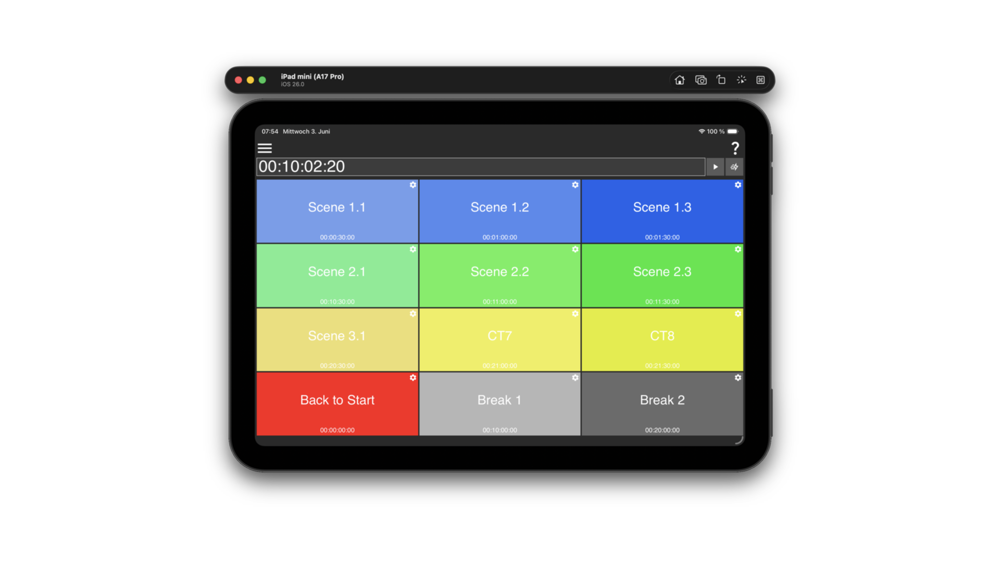

# Jumpy

A lightweight MIDI Time Code utility. Set a timecode position, trigger it instantly, or run it continuously — and jump to any of twelve preset positions via coloured buttons, OSC, or MIDI.

::: {.cta}
[Download latest release](https://github.com/ChristianAhrens/Jumpy/releases/latest)

[API Documentation](doxygen/)

[GitHub Repository](https://github.com/ChristianAhrens/Jumpy)
:::

---

## What it does

Jumpy sends **MIDI Full Frame (MTC) SysEx messages** to a selected MIDI output device. The message encodes a timecode position in `hh:mm:ss:ff` format together with the active frame rate, as defined by the MIDI Time Code specification.

There are three ways to produce an MTC output:

- **Manual trigger** — type or edit a timecode in the editor field and press the trigger button to send it once.
- **Running timecode** — press play to start a timer that advances the timecode at the selected frame rate and continuously sends MTC messages.
- **Preset buttons** — a 4×3 grid of coloured trigger buttons, each holding a named timecode position. Click a button to jump to its stored position immediately.

Preset buttons can also be activated externally via OSC address patterns or MIDI command assignments, making Jumpy usable as a remote-controlled timecode source.

## Custom trigger buttons

Each of the twelve trigger slots is independently configurable with:

- **Name** — shown as the button label.
- **Colour** — background colour for quick visual identification.
- **Timecode** — the target `hh:mm:ss:ff` position to jump to on activation.
- **OSC trigger** — a custom OSC address pattern; any matching incoming message fires the button.
- **MIDI trigger** — a MIDI command assignment learnt via the built-in MIDI learner.

Tap or click an unconfigured slot to open its settings panel. Configured buttons are saved to the application configuration and restored on the next launch.

## OSC control

Jumpy listens on a configurable UDP port (default 53000) for two address families:

| OSC address | Effect |
|:------------|:-------|
| `/Jumpy/TS hh:mm:ss:ff` | Sets and transmits the specified timecode position. |
| Per-button custom pattern | Activates the matching preset trigger button. |

The OSC port can be changed at any time from the options menu without restarting the application.

## MIDI

Jumpy opens a single MIDI output device to send MTC messages and optionally a MIDI input device to receive button-trigger commands. Both input and output devices are selected from the options menu and the choice is saved in the configuration.

Supported frame rates: **24 fps**, **25 fps**, **29.97 fps**, **30 fps** — selectable from the options menu.

## Getting started

1. Open the **options menu** (≡) and choose a MIDI output device from the *MIDI output device* submenu.
2. Select the frame rate that matches your session under *Framerate*.
3. Type a timecode into the editor field (format `hh:mm:ss:ff`) and press the trigger button (▶) to send it once, or press the play button (▷) to start a running timecode.
4. To configure a preset button, tap any grey slot and fill in its name, colour, timecode and optional OSC/MIDI trigger in the settings panel.

Full documentation including the iOS MIDI network session setup is in the [README](https://github.com/ChristianAhrens/Jumpy/blob/main/README.md).

## Platform support

| Platform | Notes |
|:---------|:------|
| macOS | Desktop app; resizable window. |
| Windows | Desktop app; resizable window. |
| iOS / iPadOS | Native app; full-screen, screen saver disabled. TestFlight beta available. |

## Get it

Binary packages for macOS and Windows are attached to every [GitHub release](https://github.com/ChristianAhrens/Jumpy/releases/latest). The iOS TestFlight beta is linked from the [repository page](https://github.com/ChristianAhrens/Jumpy#readme).

Source code, build scripts and full technical documentation are in the [GitHub repository](https://github.com/ChristianAhrens/Jumpy). Code-level API documentation is in the [Doxygen reference](doxygen/).
