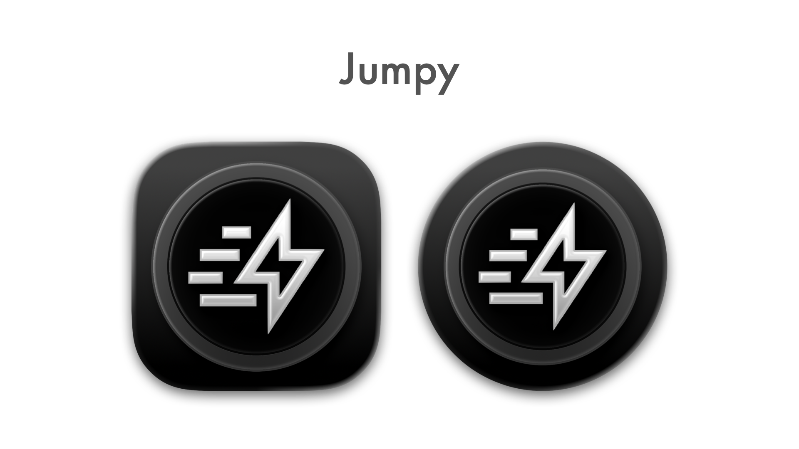
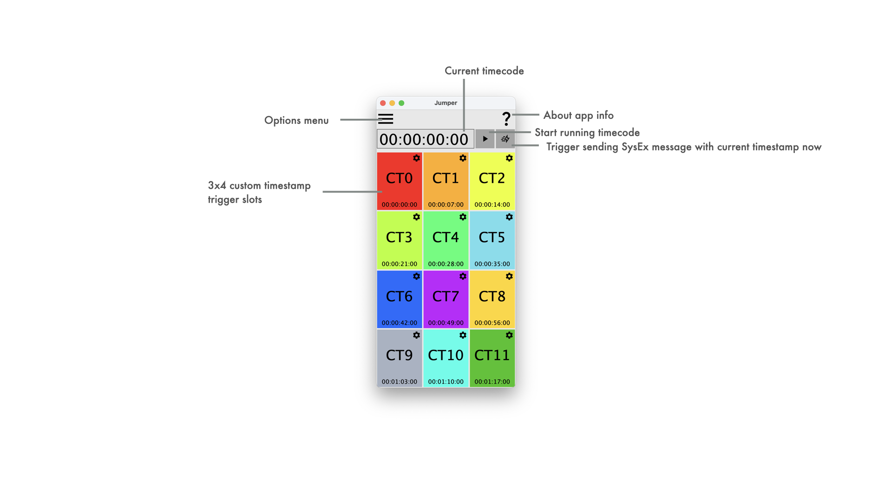
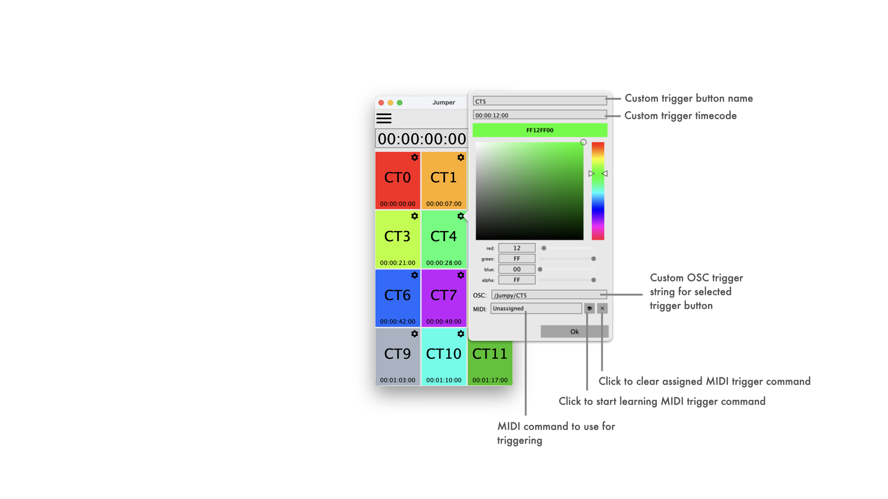

See [LATEST RELEASE](https://github.com/ChristianAhrens/Jumpy/releases/latest) for available binary packages or join iOS TestFlight Beta:

<a name="toc" />

## Table of contents

* [Introduction](#introduction)
* [Jumpy - app functionality](#Jumpy---app-functionality)
  * [Main Jumpy UI](#main-Jumpy-ui)
  * [Jumpy options menu](#Jumpy-options-menu)
  * [Custom trigger configuration](#custom-trigger-configuration)
* [MIDI network session setup - iOS to macOS](#midi-network-session-setup---ios-to-macos)

<a name="introduction" />

## Overview

Jumpy is a small test utility to send MIDI TimeCode messages to a selected MIDI output device.
Features:
- Manual timecode and framerate selection
- Triggering MTC (SysEx) message with current timecode value
- Play/pause for continuous timecode value sending (generated through async system timer - no high accuracy!)
- Triggering MTC (SysEx) message via OSC ("/Jumpy/TS hh:mm:ss:ff")
- 3x4 custom timecode trigger buttons, incl. custom name and color on UI
- OSC trigger button control via custom string

Its sourcecode and prebuilt binaries are made publicly available to enable interested users to experiment, extend and create own adaptations.

Use what is provided here at your own risk!

<a name="Jumpy" />

## Jumpy - app functionality

### Main Jumpy UI

### Jumpy options menu

### Custom trigger configuration

<a name="iOS to macOS MIDI Network Session" />

## MIDI network session setup - iOS to macOS

